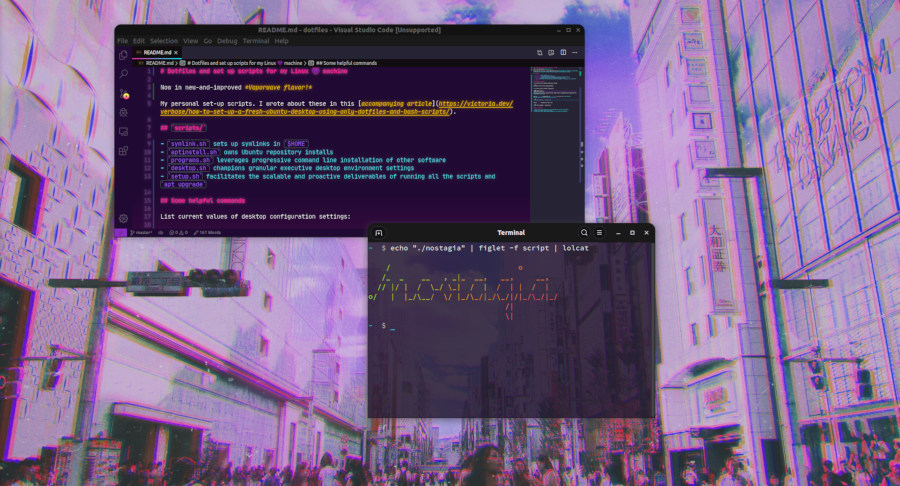

# Dotfiles and set up scripts for my Linux 💜 machine

Now in new-and-improved *Vaporwave flavor!*



My personal set-up scripts. I wrote about these in this [accompanying article](https://victoria.dev/verbose/how-to-set-up-a-fresh-ubuntu-desktop-using-only-dotfiles-and-bash-scripts/).

## Included `scripts/`

- `symlink.sh` sets up symlinks in `$HOME`
- `aptinstall.sh` owns Ubuntu repository installs
- `programs.sh` leverages progressive command line installation of other software
- `desktop.sh` champions granular executive desktop environment settings
- `setup.sh` facilitates the scalable and proactive deliverables of running all the scripts and `apt upgrade`

## Some helpful commands

List current values of desktop configuration settings:

```sh
gsettings list-recursively org.gnome.desktop
```

List current values of Terminal configuration:

```sh
GNOME_TERMINAL_PROFILE=`gsettings get org.gnome.Terminal.ProfilesList default | awk -F \' '{print $2}'`
gsettings list-recursively org.gnome.Terminal.Legacy.Profile:/org/gnome/terminal/legacy/profiles:/:$GNOME_TERMINAL_PROFILE/
```

Back up `gsettings` configuration for `/org/gnome/` to a file, via [`dconf`](https://developer.gnome.org/dconf/unstable/dconf-tool.html):

```sh
dconf dump /org/gnome/ > settings.**dconf**
```

Restore `dconf` configurations from a file:

```sh
dconf load /org/gnome/ < settings.dconf
```

## My current themes

- Visual Studio Code: [synthwave-x-fluoromachine](https://github.com/webrender/synthwave-x-fluoromachine) with custom CSS
- Desktop environment: [Numix-BLACK-Grape](https://www.pling.com/p/1335655/)
